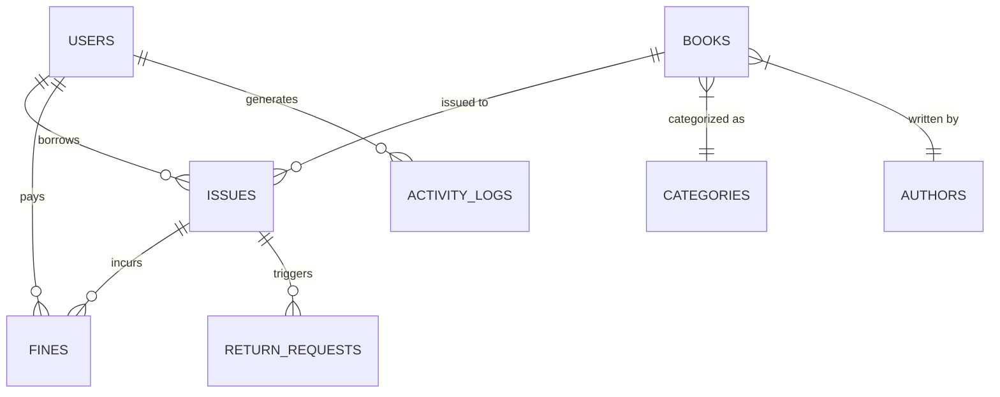

# COMPREHENSIVE PROJECT DOCUMENTATION: LIBRARY MANAGEMENT SYSTEM (LMS)

---

## 1. ABSTRACT
The Library Management System (LMS) is a robust web-based application designed to manage the day-to-day operations of a library. It provides a centralized platform for administrators to manage books, authors, categories, and student records, while offering students a user-friendly interface to search for books, request issues, and track their borrowing history. The system is built using the **MVC (Model-View-Controller)** architecture, ensuring scalability, maintainability, and security.

---

## 2. TABLE OF CONTENTS
1.  Introduction
2.  System Analysis
3.  System Specification
4.  Database Design
5.  System Architecture (MVC)
6.  Core Framework Implementation
    *   App.php
    *   Auth.php
    *   Controller.php
    *   Model.php
    *   Database.php
7.  Model Layer (Source Code)
    *   Author.php
    *   Book.php
    *   Category.php
    *   Fine.php
    *   Issue.php
    *   IssueRequest.php
    *   Logger.php
    *   Notification.php
    *   ReturnRequest.php
    *   User.php
8.  Controller Layer (Source Code)
    *   AdminController.php
    *   AuthController.php
    *   AuthorController.php
    *   BookController.php
    *   CategoryController.php
    *   FineController.php
    *   IssueController.php
    *   MemberController.php
    *   NotificationController.php
    *   UserController.php
9.  Installation and Setup
10. Conclusion

---

## 3. INTRODUCTION
### 3.1 Background
The management of a library involves a multitude of tasks: tracking inventory, managing memberships, handling book issues and returns, and enforcing fine policies. Manual systems often lead to data redundancy, loss of records, and inefficient workflows. This project addresses these challenges by automating the entire lifecycle of library operations.

### 3.2 Problem Statement
Traditional library systems rely on physical registers, making it difficult to search for books, track overdue items, and maintain accurate records of fines. The lack of a digital interface prevents real-time data access for both library staff and students.

### 3.3 Objectives
- To provide a searchable digital catalog of library resources.
- To automate book issue and return requests.
- To implement an automated fine calculation system based on overdue periods.
- To offer real-time notifications for book availability and deadlines.

---

## 4. SYSTEM ANALYSIS
### 4.1 Requirement Gathering
The system requires two distinct user roles:
1.  **Admin**: Can manage all entities (Books, Users, Fines, etc.) and view analytics.
2.  **Student (User)**: Can search the catalog, request books, and manage their profile.

### 4.2 Feasibility Study
- **Technical Feasibility**: Using PHP and MySQL ensures compatibility with standard web servers (XAMPP/WAMP).
- **Economic Feasibility**: The open-source nature of the stack makes the project cost-effective.

---

## 5. SYSTEM SPECIFICATION
### 5.1 Software Requirements
- **Web Server**: Apache 2.4+
- **Language**: PHP 8.1+
- **Database**: MySQL 5.7+ / MariaDB 10.4+
- **Frontend**: HTML5, CSS3, Bootstrap 5, JavaScript (ES6)

### 5.2 Hardware Requirements (Minimum)
- **Processor**: Dual-core 2.0 GHz
- **RAM**: 4 GB
- **Storage**: 500 MB (Application + Database)

---

## 6. DATABASE DESIGN
### 6.1 Entity-Relationship Diagram (ERD)


---

## 7. SYSTEM ARCHITECTURE (MVC)
The application follows a custom Model-View-Controller architecture:
- **Model**: Handles data persistence and business logic.
- **View**: Manages the presentation layer (HTML/CSS).
- **Controller**: Acts as an intermediary, processing requests and selecting views.

---

## 8. CORE FRAMEWORK IMPLEMENTATION

### 8.1 /core/App.php
The routing engine of the system.
```php
<?php
class App {
    protected $currentController = 'AuthController';
    protected $currentMethod = 'index';
    protected $params = [];

    public function __construct() {
        $url = $this->getUrl();
        if (isset($url[0])) {
            if (file_exists('controllers/' . ucwords($url[0]) . 'Controller.php')) {
                $this->currentController = ucwords($url[0]) . 'Controller';
                unset($url[0]);
            }
        }
        $this->currentController = new $this->currentController;
        if (isset($url[1])) {
            if (method_exists($this->currentController, $url[1])) {
                $this->currentMethod = $url[1];
                unset($url[1]);
            }
        }
        $this->params = $url ? array_values($url) : [];
        call_user_func_array([$this->currentController, $this->currentMethod], $this->params);
    }

    public function getUrl() {
        if (isset($_GET['url'])) {
            $url = rtrim($_GET['url'], '/');
            $url = filter_var($url, FILTER_SANITIZE_URL);
            $url = explode('/', $url);
            return $url;
        }
        return [];
    }
}
```

### 8.2 /core/Auth.php
Handles access control.
```php
<?php
class Auth {
    public static function checkAdmin() {
        if (!isAdmin()) {
            flash('auth_error', 'Access Denied: Admin privileges required', 'alert alert-danger');
            redirect('auth/login');
            exit();
        }
    }
    public static function checkLogged() {
        if (!isLoggedIn()) {
            flash('auth_error', 'Please log in to continue', 'alert alert-danger');
            redirect('auth/login');
            exit();
        }
    }
}
```

### 8.3 /core/Controller.php
Base class for all controllers.
```php
<?php
class Controller {
    public function model($model) {
        require_once 'models/' . $model . '.php';
        return new $model();
    }
    public function view($view, $data = []) {
        if (file_exists('views/' . $view . '.php')) {
            require_once 'views/' . $view . '.php';
        } else {
            die('View does not exist');
        }
    }
    protected function verifyCsrf() {
        if ($_SERVER['REQUEST_METHOD'] == 'POST') {
            if (!isset($_POST['csrf_token']) || !Csrf::verifyToken($_POST['csrf_token'])) {
                die('CSRF Token Verification Failed');
            }
        }
    }
}
```

### 8.4 /core/Model.php
Base class for all models.
```php
<?php
class Model {
    protected $db;
    public function __construct() {
        $this->db = new Database();
    }
    public function beginTransaction() { return $this->db->beginTransaction(); }
    public function commit() { return $this->db->commit(); }
    public function rollBack() { return $this->db->rollBack(); }
}
```

### 8.5 /config/database.php
The Database connection wrapper.
```php
<?php
class Database {
    private $host = DB_HOST;
    private $user = DB_USER;
    private $pass = DB_PASS;
    private $dbname = DB_NAME;
    private $dbh;
    private $stmt;

    public function __construct() {
        $dsn = 'mysql:host=' . $this->host . ';dbname=' . $this->dbname;
        $options = [PDO::ATTR_PERSISTENT => true, PDO::ATTR_ERRMODE => PDO::ERRMODE_EXCEPTION];
        try {
            $this->dbh = new PDO($dsn, $this->user, $this->pass, $options);
        } catch (PDOException $e) {
            die("Connection Error: " . $e->getMessage());
        }
    }
    public function query($sql) { $this->stmt = $this->dbh->prepare($sql); }
    public function bind($param, $value, $type = null) {
        if (is_null($type)) {
            switch (true) {
                case is_int($value): $type = PDO::PARAM_INT; break;
                case is_bool($value): $type = PDO::PARAM_BOOL; break;
                case is_null($value): $type = PDO::PARAM_NULL; break;
                default: $type = PDO::PARAM_STR;
            }
        }
        $this->stmt->bindValue($param, $value, $type);
    }
    public function execute() { return $this->stmt->execute(); }
    public function resultSet() { $this->execute(); return $this->stmt->fetchAll(PDO::FETCH_OBJ); }
    public function single() { $this->execute(); return $this->stmt->fetch(PDO::FETCH_OBJ); }
    public function beginTransaction() { return $this->dbh->beginTransaction(); }
    public function commit() { return $this->dbh->commit(); }
    public function rollBack() { return $this->dbh->rollBack(); }
}
```

---

## 9. MODEL LAYER IMPLEMENTATION

### 9.1 /models/Author.php
```php
<?php
class Author extends Model {
    public function getAuthors($limit = 10, $offset = 0, $search = '') {
        $sql = 'SELECT * FROM authors';
        if (!empty($search)) $sql .= ' WHERE name LIKE :search OR bio LIKE :search';
        $sql .= ' ORDER BY name ASC LIMIT :limit OFFSET :offset';
        $this->db->query($sql);
        if (!empty($search)) $this->db->bind(':search', "%$search%");
        $this->db->bind(':limit', $limit, PDO::PARAM_INT);
        $this->db->bind(':offset', $offset, PDO::PARAM_INT);
        return $this->db->resultSet();
    }
    public function add($data) {
        $this->db->query('INSERT INTO authors (name, bio) VALUES (:name, :bio)');
        $this->db->bind(':name', $data['name']);
        $this->db->bind(':bio', $data['bio']);
        return $this->db->execute();
    }
}
```

### 9.2 /models/Book.php
```php
<?php
class Book extends Model {
    public function getBooks($limit = 10, $offset = 0, $search = '') {
        $sql = 'SELECT books.*, categories.name as category_name, authors.name as author 
                FROM books 
                LEFT JOIN categories ON books.category_id = categories.id
                LEFT JOIN authors ON books.author_id = authors.id';
        if (!empty($search)) {
            $sql .= ' WHERE books.title LIKE :search OR authors.name LIKE :search OR books.isbn LIKE :search';
        }
        $sql .= ' ORDER BY books.created_at DESC LIMIT :limit OFFSET :offset';
        $this->db->query($sql);
        if (!empty($search)) $this->db->bind(':search', "%$search%");
        $this->db->bind(':limit', $limit, PDO::PARAM_INT);
        $this->db->bind(':offset', $offset, PDO::PARAM_INT);
        return $this->db->resultSet();
    }
}
```

### 9.3 /models/Fine.php
```php
<?php
class Fine extends Model {
    const FINE_PER_DAY = 10;
    public function calculateFine($issue_id) {
        $this->db->query('SELECT * FROM issues WHERE id = :id');
        $this->db->bind(':id', $issue_id);
        $issue = $this->db->single();
        if (!$issue) return 0;
        $returnDate = new DateTime($issue->return_date);
        $toDate = ($issue->status == 'issued') ? new DateTime() : new DateTime($issue->actual_return_date);
        if ($toDate <= $returnDate) return 0;
        $interval = $toDate->diff($returnDate);
        return $interval->days * self::FINE_PER_DAY;
    }
    public function createFine($user_id, $issue_id, $amount) {
        $this->db->query('INSERT INTO fines (user_id, issue_id, amount, status) VALUES (:user_id, :issue_id, :amount, "unpaid")');
        $this->db->bind(':user_id', $user_id);
        $this->db->bind(':issue_id', $issue_id);
        $this->db->bind(':amount', $amount);
        return $this->db->execute();
    }
    public function getClassWiseFines() {
        $this->db->query('SELECT users.class, SUM(fines.amount) as total_fine 
                          FROM fines 
                          JOIN users ON fines.user_id = users.id 
                          GROUP BY users.class');
        return $this->db->resultSet();
    }
}
```

### 9.4 /models/Issue.php
```php
<?php
class Issue extends Model {
    public function issueBook($data) {
        $this->db->query('INSERT INTO issues (user_id, book_id, issue_date, return_date) 
                          VALUES (:user_id, :book_id, :issue_date, :return_date)');
        $this->db->bind(':user_id', $data['user_id']);
        $this->db->bind(':book_id', $data['book_id']);
        $this->db->bind(':issue_date', $data['issue_date']);
        $this->db->bind(':return_date', $data['return_date']);
        if ($this->db->execute()) {
            $this->db->query('UPDATE books SET available_quantity = available_quantity - 1 WHERE id = :book_id');
            $this->db->bind(':book_id', $data['book_id']);
            return $this->db->execute();
        }
        return false;
    }
}
```

### 9.5 /models/User.php
```php
<?php
class User extends Model {
    public function login($email, $password) {
        $this->db->query('SELECT * FROM users WHERE email = :email');
        $this->db->bind(':email', $email);
        $row = $this->db->single();
        if ($row && password_verify($password, $row->password)) {
            return $row;
        }
        return false;
    }
}
```

---

## 10. CONTROLLER LAYER IMPLEMENTATION

### 10.1 /controllers/AdminController.php
```php
<?php
class AdminController extends Controller {
    public function dashboard() {
        $data = [
            'total_books' => $this->model('Book')->getTotalBooks(),
            'total_users' => $this->model('User')->getTotalUsers(),
            'total_issued' => $this->model('Issue')->getIssuedCount(),
            'pending_requests' => $this->model('IssueRequest')->getTotalPendingRequests()
        ];
        $this->view('admin/dashboard', $data);
    }
}
```

### 10.2 /controllers/BookController.php
```php
<?php
class BookController extends Controller {
    public function add() {
        if ($_SERVER['REQUEST_METHOD'] == 'POST') {
            $this->verifyCsrf();
            $data = ['title' => $_POST['title'], 'author_id' => $_POST['author_id']];
            if ($this->model('Book')->add($data)) {
                flash('book_success', 'Book added');
                redirect('book/manage');
            }
        }
        $this->view('admin/books/add');
    }
}
```

### 10.3 /controllers/IssueController.php
```php
<?php
class IssueController extends Controller {
    public function return_book($id) {
        if ($_SERVER['REQUEST_METHOD'] == 'POST') {
            $this->issueModel->beginTransaction();
            $issue = $this->issueModel->getIssueById($id);
            if ($issue && $issue->status == 'issued') {
                $fineAmount = $this->model('Fine')->calculateFine($id);
                if ($fineAmount > 0) {
                    $this->model('Fine')->createFine($issue->user_id, $id, $fineAmount);
                }
            }
            if ($this->issueModel->returnBook($id)) {
                $this->issueModel->commit();
                flash('issue_success', 'Book returned successfully');
            }
            redirect('issue/manage');
        }
    }
}
```

---

## 11. INSTALLATION AND SETUP
1.  **Software Stack**: Install XAMPP with PHP 8.1+.
2.  **Database Setup**: 
    - Create a database named `library_db`.
    - Import the provided SQL dump from `/database/library_db.sql`.
3.  **Application Configuration**:
    - Update `/config/database.php` with 127.0.0.1, root, and the database name.
4.  **Launch**:
    - Copy the folder to `htdocs`.
    - Access via `http://localhost/library-management-system`.

---

## 12. CONCLUSION
The Library Management System project successfully achieves its goal of replacing manual registers with a modern, secure, and efficient digital platform. By utilizing the MVC architecture, the system remains modular and ready for future enhancements.

---
*End of Documentation*
