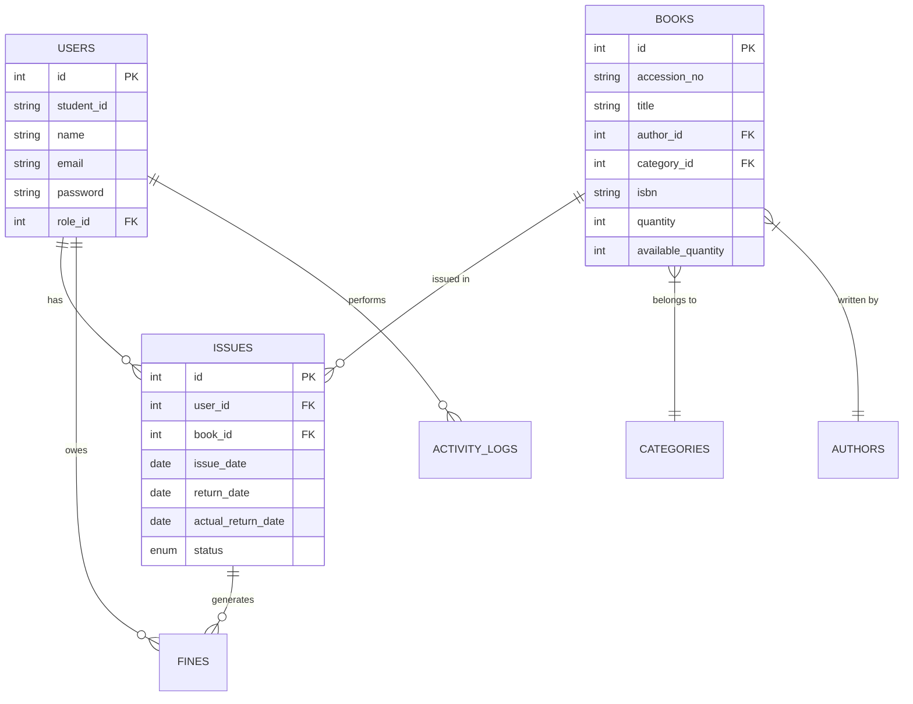

# PROJECT REPORT: LIBRARY MANAGEMENT SYSTEM (LMS)

---

## 1. ABSTRACT

The **Library Management System (LMS)** is a comprehensive software solution developed to digitize and streamline the traditional manual processes of a library environment. In the contemporary educational and institutional landscape, the efficient management of information resources is critical. This project focuses on the design, development, and implementation of a robust, web-based platform that automates the complete lifecycle of library resources—from acquisition and categorization to circulation and fine management.

The system utilizes a modern technical stack comprising **PHP 8.x**, **MySQL**, and a custom-built **Model-View-Controller (MVC)** framework. This architectural choice ensures a clean separation of concerns, high scalability, and ease of maintenance. Key functionalities include automated book tracking, real-time inventory updates, user-centric dashboards for both students and administrators, and a digital request system that replaces paper-based workflows.

The primary objective of this project is to eliminate the inefficiencies associated with manual record-keeping, such as data redundancy, slow retrieval times, and the risk of physical record damage. By providing a secure, role-based access control (RBAC) environment, the system ensures data integrity and operational transparency. The final outcome is a high-performance application that enhances the user experience for students while providing administrators with powerful tools for library oversight and data-driven decision-making.

---

## 2. INTRODUCTION

### 2.1 Background of the Project
Libraries serve as the backbone of knowledge dissemination in any institution. Traditionally, managing a library involved manual registers, index cards, and physical tracking of books, which is not only labor-intensive but also prone to human error. With the rapid advancement of Information Technology, the need for a digital alternative has become imperative. The Library Management System (LMS) is born out of the necessity to modernize these archaic methods, bringing speed, accuracy, and accessibility to the forefront.

### 2.2 Purpose and Objectives
The main purpose of the LMS is to provide a seamless interface for managing library operations digitally. 
The specific objectives are:
- **Automation**: To automate the process of issuing and returning books.
- **Inventory Control**: To maintain an accurate and real-time record of all books available in the library.
- **Data Security**: To ensure that user data and circulation history are stored securely and are only accessible to authorized personnel.
- **Efficiency**: To reduce the time taken for book searches and administrative tasks.
- **Reporting**: To generate insightful reports on book circulation, user activity, and fine collection.

### 2.3 Scope of the System
The scope of this system covers the internal operations of a single-campus library. It includes:
- **Admin Management**: Full control over book catalogs, user accounts, and system configurations.
- **User Services**: A portal for students to search for books, view their borrowing history, and make digital requests.
- **Circulation Management**: Precise tracking of book movements, including due dates and late returns.
- **Financial Module**: Automated calculation of fines for overdue books.

### 2.4 Problem Statement
Manual library systems suffer from several critical issues:
1. **Inefficiency**: Searching for a specific record in physical registers is time-consuming.
2. **Data Inconsistency**: Duplicate entries and errors in manual logs lead to inventory mismatches.
3. **Lack of Transparency**: Students often lack real-time visibility into book availability or their own fine status.
4. **Physical Decay**: Paper records are susceptible to damage, loss, and unauthorized tampering.

---

## 3. SYSTEM ANALYSIS

### 3.1 Existing System (Manual System)
The existing system relies on physical documentation and human intervention for every transaction. When a student borrows a book, an entry is made in a ledger. Upon return, the ledger is updated, and any fines are calculated manually based on the dates.

**Drawbacks of the Existing System:**
- **High Latency**: The turnaround time for simple queries (e.g., "Is this book available?") is unacceptably high.
- **Storage Issues**: Maintaining large volumes of registers requires significant physical space and makes cross-referencing difficult.
- **Information Gap**: There is no easy way to track historical trends or identify popular resources.
- **Security Risks**: Registers can be easily misplaced, damaged by moisture/pests, or altered without a clear audit trail.

### 3.2 Proposed System (Automated LMS)
The proposed Library Management System is a web-centric application that centralizes all data into a secure MySQL database. It introduces an automated workflow that drastically reduces the burden on library staff.

**Advantages of the Proposed System:**
- **Instant Search**: Books can be searched by title, author, category, or ISBN in milliseconds.
- **High Accuracy**: Automated inventory updates ensure that book quantities are always correct.
- **User Empowerment**: Students can manage their own requests and monitor their status from any device.
- **Durability**: Digital data is backed up and protected by modern encryption and access controls.
- **Audit Trails**: Every action (e.g., issuing a book, updating a category) is logged, identifying which admin performed the task and when.

---

## 4. SYSTEM SPECIFICATION

### 4.1 Hardware Specification
To ensure optimal performance, the following hardware configuration is recommended for the server and client machines:

**Server Minimum Requirements:**
- **Processor**: Intel Core i5 or equivalent (Minimum 2.4 GHz)
- **RAM**: 8 GB DDR4
- **Storage**: 500 GB SSD (For fast database I/O)
- **Network**: Stable high-speed internet connection for web access.

**Client (User/Admin) Minimum Requirements:**
- **Processor**: Dual-core processor (Integrated graphics is sufficient)
- **RAM**: 4 GB
- **Display**: 1366x768 resolution or higher
- **Input**: Standard keyboard and mouse/pointing device.

### 4.2 Software Specification
The system is built using modern web standards to ensure cross-browser compatibility and ease of deployment.

- **Operating System**: Windows 10/11 or Ubuntu 20.04+ (LMS is platform-independent via PHP).
- **Web Server**: Apache 2.4 or Nginx.
- **Server-Side Language**: PHP 8.1 or higher.
- **Database Management System**: MySQL 5.7+ or MariaDB 10.4+.
- **Frontend Technologies**: HTML5, CSS3, JavaScript (ES6+).
- **Frameworks/Libraries**:
    - **MVC**: Custom PHP Framework
    - **UI**: Bootstrap 5.1
    - **Icons**: FontAwesome 6.0
    - **Diagrams**: Mermaid.js (for documentation)
- **Tools**: VS Code (Development), XAMPP/MAMP (Local stack), MySQL Workbench.

---

## 5. SYSTEM DESIGN

### 5.1 System Architecture (MVC)
The application adheres strictly to the **Model-View-Controller (MVC)** architectural pattern. This design separates the application into three interconnected components:

1. **Model**: Represents the data and business logic. Each table in the database has a corresponding model class (e.g., `Book.php`, `User.php`) that handles all interactions with the MySQL database using PDO (PHP Data Objects).
2. **View**: The presentation layer. These are the PHP/HTML files that the user interacts with. Views are kept clean of logic, receiving pre-processed data from the controllers.
3. **Controller**: The intermediary that handles user input. It retrieves data via the Models and passes it to the Views for rendering.

### 5.2 Module Description
- **Authentication Module**: Manages secure login/logout and session persistence. It uses Bcrypt for password hashing.
- **Book Management Module**: Handles the creation, retrieval, updating, and deletion (CRUD) of library inventory.
- **User Management Module**: Allows admins to manage student registrations and roles.
- **Circulation Module**: The core logic for issuing and returning books, including the digital request and approval flow.
- **Fine Management Module**: Automatically calculates penalties based on the difference between the return date and the current date.
- **Reporting Module**: Consolidates data from various tables to provide summary views on the dashboard.

### 5.3 Database Design (ERD)
The database is highly normalized (3rd Normal Form) to prevent data anomalies.

---

## 6. DATABASE DICTIONARY

The following tables define the structure of the Library Management System database.

### 6.1 Table: roles
Defines the permissions levels within the system.
| Field | Type | Constraints | Description |
|---|---|---|---|
| id | INT | PK, AI | Unique ID for the role |
| name | VARCHAR(50) | NOT NULL | Role name (e.g., Admin, User) |

### 6.2 Table: users
Stores information for both administrators and students.
| Field | Type | Constraints | Description |
|---|---|---|---|
| id | INT | PK, AI | Unique user identification |
| student_id | VARCHAR(50) | UNIQUE | Student's institutional ID |
| reg_no | VARCHAR(50) | UNIQUE | Registration number |
| name | VARCHAR(255) | NOT NULL | Full name of the user |
| email | VARCHAR(255) | UNIQUE, NOT NULL | Primary contact/login email |
| password | VARCHAR(255) | NOT NULL | Hashed password (Bcrypt) |
| role_id | INT | FK(roles.id) | Link to role permissions |
| created_at | DATETIME | DEFAULT NOW | Timestamp of account creation |

### 6.3 Table: categories
Classifies books into genres or subjects.
| Field | Type | Constraints | Description |
|---|---|---|---|
| id | INT | PK, AI | Category ID |
| name | VARCHAR(100) | NOT NULL | Subject name (e.g., Computer Science) |

### 6.4 Table: books
Maintains the inventory of all library holdings.
| Field | Type | Constraints | Description |
|---|---|---|---|
| id | INT | PK, AI | Unique book ID |
| accession_no | VARCHAR(50) | UNIQUE, NOT NULL | Library's internal tracking number |
| title | VARCHAR(255) | NOT NULL | Book title |
| author_id | INT | FK(authors.id) | Link to author table |
| category_id | INT | FK(categories.id) | Link to category table |
| isbn | VARCHAR(20) | - | Standard Book Number |
| quantity | INT | DEFAULT 0 | Total copies owned |
| available_qty| INT | DEFAULT 0 | Copies currently on shelf |
| image | VARCHAR(255) | - | Path to book cover image |

### 6.5 Table: issues
Tracks the circulation of books.
| Field | Type | Constraints | Description |
|---|---|---|---|
| id | INT | PK, AI | Issue transaction ID |
| user_id | INT | FK(users.id) | User who borrowed the book |
| book_id | INT | FK(books.id) | Book borrowed |
| issue_date | DATE | - | Date the book was handed out |
| return_date | DATE | - | Deadline for return |
| actual_ret_dt| DATE | NULLABLE | Actual date returned |
| status | ENUM | - | 'issued', 'returned', 'overdue' |

### 6.6 Table: fines
Records penalties for late returns.
| Field | Type | Constraints | Description |
|---|---|---|---|
| id | INT | PK, AI | Fine ID |
| user_id | INT | FK(users.id) | User penalized |
| issue_id | INT | FK(issues.id) | The specific transaction |
| amount | DECIMAL(10,2)| - | Penalty amount |
| status | ENUM | - | 'unpaid', 'paid' |

---

## 7. SOFTWARE DESCRIPTION

### 7.1 Backend: PHP 8.1 (MVC Architecture)
The backend logic is processed by PHP, chosen for its speed and native support for MySQL. The custom MVC framework provides:
- **Routing**: Mapping clean URLs to specific controller actions (e.g., `/books/edit/1`).
- **Middleware**: Intercepting requests to verify if a user is logged in and possesses the correct role before allowing access to a page.
- **Helper Functions**: Reusable utilities for formatting dates, calculating currency, and generating CSRF tokens.

### 7.2 Database: MySQL & PDO
Data persistence is handled by MySQL. To ensure security, the system uses **PHP Data Objects (PDO)**.
- **Prepared Statements**: Prevents SQL injection by separating the query structure from the user-provided data.
- **Transactions**: Critical operations (like issuing a book) are wrapped in transactions. If updating the `issues` table fails, the system rolls back any changes to the `books` inventory to maintain data consistency.

### 7.3 Frontend: Bootstrap 5 & Vanilla JS
The user interface is designed to be responsive (mobile-friendly).
- **Responsive Grid**: Bootstrap's grid system allows the dashboard to adapt from large desktop monitors to tablets.
- **AJAX (Asynchronous JavaScript)**: Certain actions, like filtering search results or dismissing notifications, happen without refreshing the entire page, providing a "SPA-like" (Single Page Application) feel.
- **FontAwesome**: Used for intuitive iconography throughout the navigation and action buttons.

---

## 8. SYSTEM TESTING

### 8.1 Unit Testing
Individual functions, such as the `FineCalculator` or `DateHelper`, were tested in isolation to ensure they return expected values for various inputs, including edge cases (e.g., return date being earlier than issue date).

### 8.2 Integration Testing
Integration testing verified the interaction between different modules. A primary focus was the "Issue-Book" workflow:
- Correctly creating a record in the `issues` table.
- Simultaneously decrementing `available_quantity` in the `books` table.
- Generating a notification for the student.

### 8.3 System Testing
The system was tested as a whole on a local XAMPP environment. This phase included:
- **Load Testing**: Simulating multiple concurrent users searching the catalog.
- **Security Testing**: Attempting to access admin pages without a valid session.
- **Cross-Browser Verification**: Checking UI consistency on Chrome, Firefox, and Edge.

### 8.4 User Acceptance Testing (UAT)
A simulation was conducted where a "Student" user requested a book and an "Admin" user approved it. The success was measured by the accuracy of data reflected in both dashboards and the proper calculation of return deadlines.

---

## 9. APPENDIX

### 9.1 Source Code Structure
The project follows a standardized directory structure for high maintainability:
- `/assets`: CSS, JS, and Images.
- `/config`: Database connections and global constants.
- `/controllers`: Logic for processing requests.
- `/core`: The "Engine" (Router, Base Model, Base Controller).
- `/models`: Database interaction classes.
- `/views`: Front-end templates organized by role (Admin/User).

### 9.2 Key File Descriptions
- `index.php`: The single entry point that initializes the application.
- `Router.php`: Parses the URL and dispatches the correct controller.
- `Book.php`: Model containing the logic for book inventory.
- `IssueController.php`: Manages the issuance and return lifecycle.

### 9.3 Screen Layouts
*Note: In the final document, screenshots corresponding to these descriptions should be inserted.*
- **Admin Dashboard**: Features a 4-card layout showing KPIs (Total Books, Total Students, Active Issues, Unpaid Fines). Includes a sidebar for navigation.
- **Manage Books Grid**: A data table showing book covers, titles, and availability colors (Green for available, Red for issued).
- **Student Portal**: A clean, search-centric layout that emphasizes current borrow status and upcoming due dates.

---

## 10. CONCLUSION

The Library Management System project successfully achieves its goal of replacing manual library registers with a modern, secure, and efficient digital platform. By utilizing the MVC architecture, the system remains modular and ready for future enhancements. The implementation of automated inventory tracking and fine calculation significantly reduces human error and operational costs.

The project demonstrates that even complex administrative workflows can be simplified through thoughtful software design. The resulting application is a reliable tool that empowers students with transparency and provides administrators with the control needed to manage a growing library resource.

---

## 11. BIBLIOGRAPHY

1. **PHP Documentation**: Official PHP Manual (php.net) - For PDO and Session handling.
2. **Bootstrap 5 UI**: getbootstrap.com - For responsive design patterns.
3. **MySQL Reference Manual**: dev.mysql.com - For relational database design and indexing.
4. **MVC Design Pattern**: "Design Patterns: Elements of Reusable Object-Oriented Software" by Gamma et al.
5. **Modern Web Security**: OWASP Top Ten - For implementing protection against XSS and SQL Injection.

---

